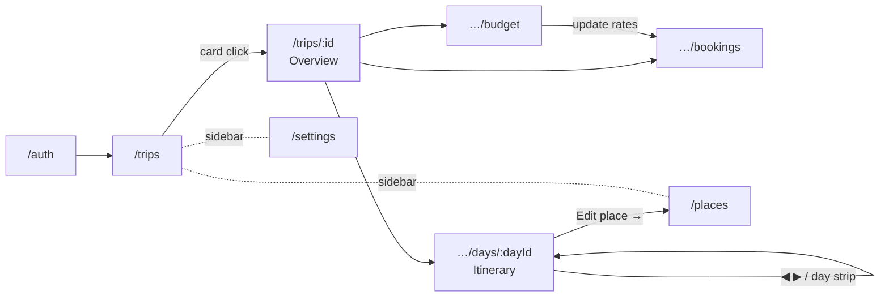
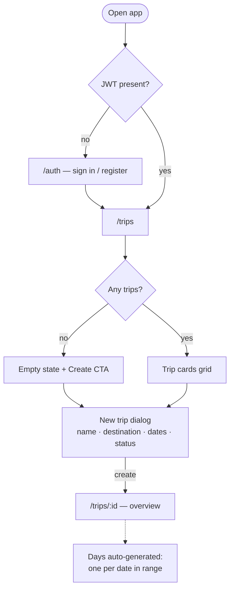
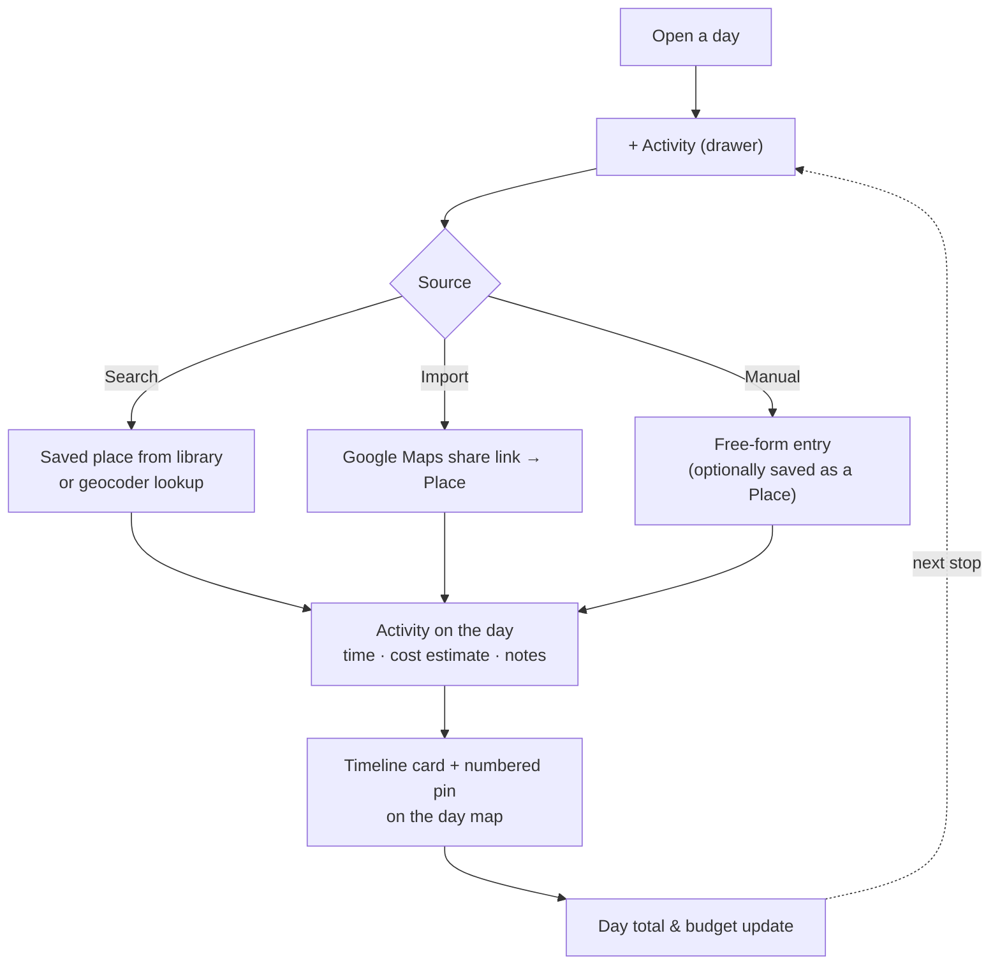
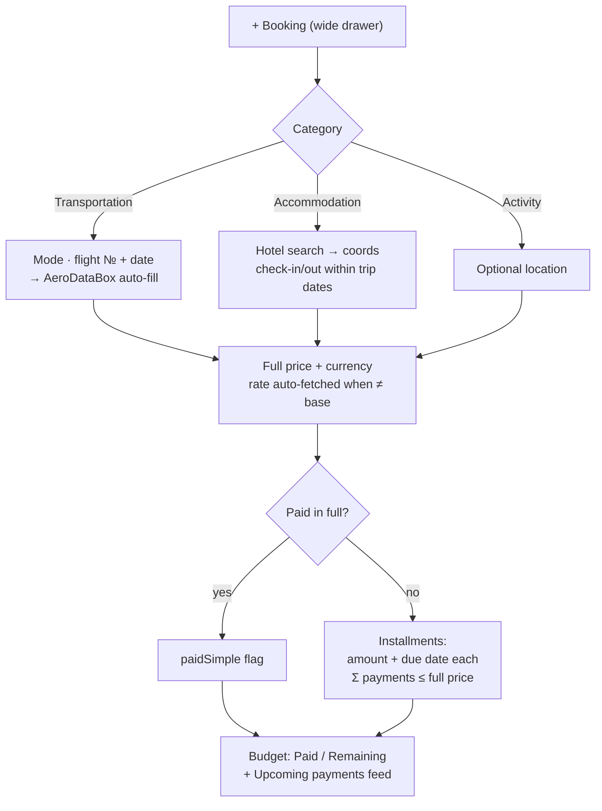
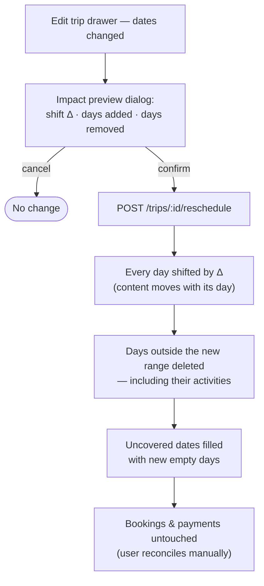
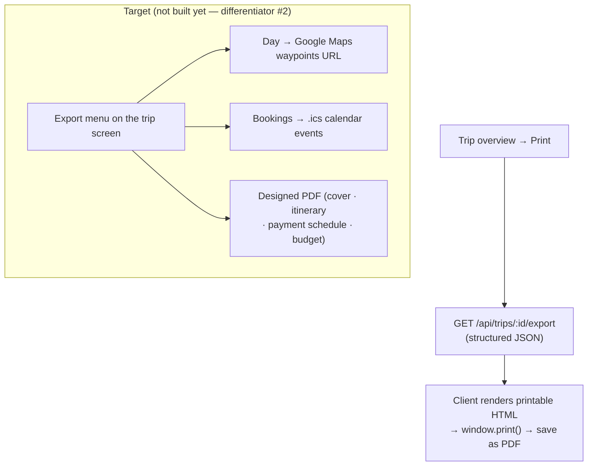
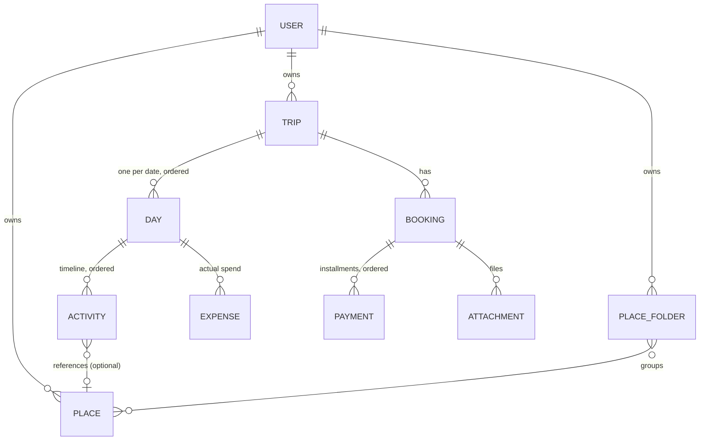

# Tripyfull — Application Spec: Views, Flows & Logic

**Status:** v1 · July 2026
**Related docs:** [`persona_jbtd.md`](persona_jbtd.md) (product frame, personas, JTBD) ·
[`competitor_analysis.md`](competitor_analysis.md) · [`user_flow.md`](user_flow.md) (early flow sketches) ·
[`../frontend/docs/CONCEPT.md`](../frontend/docs/CONCEPT.md) ·
[`../frontend/docs/ARCHITECTURE.md`](../frontend/docs/ARCHITECTURE.md)

This is the canonical description of **how the app looks, what the flows are, and what logic runs
underneath**. It reconciles three sources: the "Use Cases, Requirements & Views" draft, the
implemented system (Spring Boot backend + Vue portal), and the planner UI-kit mockup
(`design-system/ui_kits/planner`). Where the draft and the code disagree, this doc describes **the
code as it is** and records the difference in §9 *Gaps & decisions* — so it can double as the
alignment backlog.

---

## 1. Product frame (recap)

**One sentence:** a personal trip planner that treats a trip the way a tour operator would —
day-by-day itinerary, bookings with a *payment schedule*, and a live budget, all in one place.

- **Darina** (blogger, beginner): plans in detail on a laptop; wants "the whole itinerary and how
  much I can still spend — on one screen".
- **Helga** (accountant, advanced): plans far ahead, pays in installments; needs export (PDF, maps,
  calendar) and in-trip tracking.

**Differentiators** (from `competitor_analysis.md`):
1. **Money first-class** — payment states & schedule per booking, plan-vs-actual view.
2. **Data freedom** — export is free and prominent, never paywalled.
3. **Fewer features, zero lag** — four core modules (itinerary · places+map · bookings+payments ·
   budget) at spreadsheet responsiveness.

**Boundaries:** no booking engine, no affiliate deals, no fare search, no place ratings,
no collaboration (single-user accounts).

---

## 2. Information architecture

### App shell

Authenticated pages render inside a fixed **left sidebar + main content** shell
(`app/portal/src/App.vue`). The `/auth` page renders bare.

```
┌ Tripyfull (logo → /trips)
├ All trips                        ← global
├ ── trip context (only when a trip is active) ──
│   TRIP  ·  {title}  ·  {destination · dates}
│   Overview      → /trips/:id
│   Itinerary     → /trips/:id/days/:firstDayId
│   Bookings      → /trips/:id/bookings
│   Budget        → /trips/:id/budget
├ Places                           ← global library
└ {avatar} {username} · Settings · Sign out · [base currency chip]
```

The sidebar keeps the last visited trip in context even on global pages (e.g. `/places`), so the
user can jump back into the trip with one click.

### Routes

| Route | View | Purpose |
|---|---|---|
| `/auth` | `Auth.vue` | Sign in / register (tabs), no sidebar |
| `/trips` | `TripList.vue` | Home: trip cards grid, status filter, create |
| `/trips/:id` | `TripDetail.vue` | **Trip overview (dashboard)**: budget summary, upcoming payments, day tiles, quick links |
| `/trips/:tripId/days/:dayId` | `DayItinerary.vue` | One day: activity timeline + sticky route map |
| `/trips/:tripId/bookings` | `BookingsView.vue` | Bookings grouped by category, payments, attachments |
| `/trips/:tripId/budget` | `BudgetView.vue` | Budget: plan vs actual, payment schedule, per-day table |
| `/places` | `PlaceLibrary.vue` | Global reusable place library (folders, filters, grid/list) |
| `/settings` | `AccountSettings.vue` | Currency, language, region, date/time format |

All routes are lazy-loaded; `meta.requiresAuth` guards redirect to `/auth?redirect=…`.

### Overlays — forms never get routes

Editing happens **in place**: drawers for big forms, dialogs for small/focused ones
(this is the planner-kit rule: *"forms live in Side Drawers / a Dialog, not separate pages"*).

| Overlay | Kind | Opens from |
|---|---|---|
| New trip | dialog | Trip list (`+ New trip`, empty state CTA) |
| Edit trip | **drawer** | Trip overview → Edit |
| Reschedule impact preview | dialog | Edit-trip drawer when dates change |
| Activity add/edit | **drawer** (3-way source: Search / Import / Manual) | Day itinerary |
| Booking add/edit | **wide drawer** (category-conditional form) | Bookings |
| Payment add/edit | dialog | Booking drawer |
| Expense add | dialog | Budget |
| Place add/edit · Find (geocode) · Import (Maps link) · Folder | dialogs | Place library |
| Confirm delete (trip / place / activity / booking) | confirm dialog | everywhere destructive |

### Navigation map



---

## 3. Screens

### 3.1 Auth (`/auth`)

Centered animated card: Sign in / Register tab switch, username + password, submit.
Inline error from the API; button spinner while loading. On success stores the JWT + profile
(base currency, formats) and redirects to the original target or `/trips`.

### 3.2 Trip list (`/trips`) — home

- **Head:** eyebrow "Tripyfull", H1 "My trips", `+ New trip` button.
- **Filter:** segmented status filter — All / Draft / Planned / Active / Completed.
- **Grid of trip cards:** gradient "wash" header keyed to status (neutral/gold/ocean/dusk),
  status badge, title + destination, date range, hover-revealed delete (×).
- **States:** 3-card skeleton grid while loading · empty state ("No trips yet" + CTA; a filtered
  empty state without CTA).
- **New trip dialog:** title* · destination (city autocomplete) · date range · status.
  Info note: *"Days will be generated automatically from your selected dates."*

### 3.3 Trip overview (`/trips/:id`) — the dashboard

The command center of a trip; every widget links into its section.

- **Head:** status eyebrow, trip title, destination · date range; **Edit** (drawer) and
  **Print** buttons.
- **Budget summary card:** Planned / Paid / Remaining figures, progress bar, "% paid".
- **Upcoming payments card:** next 3 unpaid payments (category icon · due date · amount).
- **Trip days:** 4-column grid of day tiles — "Day N", date, city (inline-editable, pencil →
  input → check). Click → day itinerary.
- **Quick links:** Bookings · Budget.
- **States:** skeletons; "No days yet" empty state with a *Set dates* CTA — days are generated
  automatically once dates exist (create, edit, or a self-healing backfill); budget-absent fallback.
- **Edit-trip drawer:** title, destination, dates, status. If dates changed, a **reschedule
  confirmation dialog** first shows the impact — how many days shift, which get added, which get
  removed (with their content) — then calls `POST /reschedule`.

### 3.4 Day itinerary (`/trips/:tripId/days/:dayId`)

Two-column screen — the emotional core of the category (map + list side by side).

- **Head:** ◀ ▶ prev/next day, eyebrow "Day N · date", **city as H1**, `+ Activity`.
- **Day-picker strip:** D1 D2 D3… chips for direct jumps (uses `router.replace`).
- **Left column:**
  - *Visiting / Overnight card* — city (inline `TfCitySearch`), overnight stay: manual text
    **or** a suggestion derived from an ACCOMMODATION booking covering this date, applied as a
    "linked booking" chip (can be unlinked).
  - *Activity timeline* — time gutter + a card per activity: category icon, name, type badge,
    time · address · linked place · "N on the map" pill, notes, cost. Ordered by
    manual order (drag a card to reorder — the numbered map pins follow); a
    "Sort by time" action re-orders by start time in one click.
  - *Day total by category* footer card.
- **Right column:** sticky **day-route map** (Leaflet, lazy-loaded) — numbered teal pins matching
  the timeline numbers, dashed route line between stops.
- **Activity drawer — 3-way source picker:**
  1. **Search** — pick from saved places, or find a new one via the geocoder;
  2. **Import** — paste a Google Maps share link → place is created (`source=IMPORTED`);
  3. **Manual** — name/type/address/coordinates, optional *"save as a place"*.
  Shared fields: start/end time, cost estimate + currency, notes. A linked place shows
  *"Edit place →"* (jumps to `/places?edit=<id>`).
- **States:** page skeleton · "Nothing planned yet" empty state with quick-add grid of the city's
  saved places · map empty state ("No places with coordinates yet").

### 3.5 Bookings (`/trips/:tripId/bookings`)

- **Head:** `+ Booking` · `Update rates` · `CSV` (import).
- **Groups by category:** Transport / Accommodation / Activities — header with icon + count,
  then a card per booking: category icon, name, **payment-status dot** (Paid / Partial / Unpaid),
  attachment count, meta line (route/dates/nights), *next payment* line, dual-currency full price
  (`120 USD | ≈110 EUR`).
- **Booking drawer (wide), category-conditional:**
  - *Transportation:* transport mode (flight/ferry/bus/metro/car rental/taxi/walk); **flight
    number + date → auto-fill** (airline, airports, times, terminals via AeroDataBox); from/to
    place search + mini-map; ferry (vessel, cabin) and car-rental (class) extras.
  - *Accommodation:* hotel search (auto-fills name/city/coords/address) + mini-map, city,
    check-in/out **bounded by trip dates**, times, room type, guests; live *nights* and
    *price per night*.
  - *Activity:* optional location + map.
  - *Money:* full price + currency with an **exchange-rate panel** (fetch/refresh, live conversion
    preview). Either **"Paid in full"** or an **installment schedule** — payments with amount +
    due date, mark paid/unpaid, a *"payments total = full price"* match indicator.
  - *Attachments:* upload / download / delete (multipart, ≤ 10 MB).
- **States:** skeletons · empty state · per-booking status tones · "save first" hints for
  payments/attachments on unsaved bookings · rate-unavailable / flight-not-found toasts.

### 3.6 Budget (`/trips/:tripId/budget`)

- **4 metric tiles:** Planned / Paid / **Remaining to pay** (clickable highlight) / Spent in trip.
- **Overall progress bar** — turns danger-red with an *over budget* label when paid exceeds
  planned.
- **Due payments** list — each with a mark-paid button; "All payments settled" success state.
- **"Where money goes"** — per-category bars with an **Actual / Plan / Both** segmented switch;
  categories that overshoot the plan get red styling + overspend amount.
- **Day-by-day accordion table** — Plan / Actual / Δ per day, filter All/Food/Transport/Activity;
  a row expands into that day's expenses (delete, "+ add expense for this day").
- **Expense dialog:** day · category (food/transport/activity/accommodation/other) · amount +
  currency · description.
- **Warnings:** missing-exchange-rate banner (links to Bookings → Update rates) · overspend alert.

### 3.7 Place library (`/places`) — global, cross-trip

- **Head:** `Find` (geocoder) · `Import` (Google Maps link) · `+ Add place`.
- **Folder chips row:** All · one chip per folder (color dot + count) · `+ Folder`; rename/delete
  the active folder.
- **Filter bar:** search, country (trip countries pinned with ★), type, visibility, source, city,
  sort (name / recent / type).
- **Grid** (photo cover, visibility badge, type icon, name, location, tags, links, folder select,
  edit/delete) **or list** (compact rows) — segmented toggle.
- Own places are editable; other users' **public** places are read-only ("shared" tag).
- Supports deep-link `?edit=<id>` (used by Day itinerary's "Edit place →").

### 3.8 Settings (`/settings`)

Narrow page of stacked cards: base **currency**, language, region, date & time format with a live
preview. Reset / Save. Persists via `PATCH /api/auth/me` and updates the reactive prefs +
`localStorage`.

---

## 4. Core flows

### F1 · Entry & trip creation



Days are **never created manually** — they derive from the date range on create, and are shifted /
filled / dropped on reschedule.

### F2 · Core planning loop (the daily cycle)



The **place library is the "unassigned" pool**: places exist independently of trips; putting one
on a day means creating an *activity* that references it. Two visits to the same place = two
activities (duplicates are legal by design); geocoded lookups are deduped per owner by `osmId`.

### F3 · Bookings & payment schedule



Payment states in the UI: **Paid / Partial / Unpaid** per booking; each installment is
independently paid (with `paidDate`) or due (`dueDate`). "Deposit now, rest later" is simply a
2-installment schedule.

### F4 · Reschedule (change of trip dates)



### F5 · Export



Export must stay **free and always visible** (TripCase lesson). Both missing formats are
client-side friendly: a Maps deep link is just an ordered-waypoints URL, and `.ics` is a text
format — no backend work strictly required.

---

## 5. Domain model & logic

### Entities



| Entity | Key fields (beyond id/relations) |
|---|---|
| **Trip** | title*, destination, startDate, endDate, baseCurrency (default EUR), coverImage, status |
| **Day** | date*, city, overnightStay, linkedBookingId, notes |
| **Activity** | name*, type, startTime/endTime, address, costEstimate + costCurrency, notes, orderIndex, placeId? |
| **Booking** | name*, category, vendor, confirmationNumber, bookingUrl, fullPrice + priceCurrency + exchangeRate, notes, paidSimple, linkedDayId + per-category field groups: flight (number, IATA from/to, terminals, seat, departure/arrival at), ferry (vessel, cabin), car rental (class), accommodation (city*, check-in/out + times, roomType, guests), location (address, lat/lng) |
| **Payment** | sequence, amount*, dueDate, paid, paidDate |
| **Attachment** | fileName*, contentType, size, storageKey (local disk), uploadedAt |
| **Place** | name*, type, country (ISO-2), city, address, lat/lng, description, osmId, photos[], links[], visibility, source |
| **PlaceFolder** | name*, color — a place sits in ≤ 1 of a user's folders; public places by others can be filed too |
| **Expense** | category, amount*, currency, description, spentAt |
| **User** | username*, email, baseCurrency, language, region, dateFormat, timeFormat |
| **City / Country** | seeded geo reference data for city/country autocomplete |

**Enums:**
`TripStatus` DRAFT · PLANNED · ACTIVE · COMPLETED —
`BookingCategory` TRANSPORTATION · ACCOMMODATION · ACTIVITY —
`TransportMode` FLIGHT · FERRY · BUS · METRO · CAR_RENTAL · TAXI · WALK —
`ActivityType` SIGHTSEEING · BEACH · NATURE · NEIGHBORHOOD · RESTAURANT · MEAL_STOP · SHOPPING · TRANSPORT · OTHER —
`PlaceType` SIGHTSEEING · BEACH · NATURE · RESTAURANT · MUSEUM · VIEWPOINT · PORT · AIRPORT · NEIGHBORHOOD · PARK · SHOP · OTHER —
`PlaceSource` GEOCODED · MANUAL · IMPORTED —
`PlaceVisibility` PUBLIC · PRIVATE —
`ExpenseCategory` FOOD · TRANSPORT · ACTIVITY · ACCOMMODATION · OTHER.

### Day lifecycle rules

- **Create trip** with both dates → one empty `Day` per date in `[start, end]`.
- **Reschedule** (`POST /trips/:id/reschedule`): requires valid dates (`end ≥ start`). Anchor =
  current start (or earliest day). All days shift by the delta **keeping their content**; days
  falling outside the new range are deleted **with their activities** (orphan removal); missing
  dates are filled with empty days. Bookings/payments are deliberately untouched.
- **"Generate days"** (`POST /trips/:id/days`) is **backfill-only**: it now 409s when days
  already exist, so day content can never be wiped by it; date changes go through reschedule.
  Days are also auto-generated by trip update when dates are set on a day-less trip.

### Budget math (`BudgetService`, computed in the *user's* base currency)

```
bookingsTotal     = Σ booking.fullPrice        × rate→base
bookingsPaid      = Σ payments[paid]           × rate→base     ← "Paid"
bookingsRemaining = Σ payments[!paid]          × rate→base     ← "Remaining to pay"
totalPlanned      = Σ activity.costEstimate (raw) + bookingsTotal   ← "Planned"
totalActual       = Σ expense.amount (raw)                     ← "Spent in trip"
upcomingPayments  = payments[!paid] sorted by dueDate (nulls last)
plannedByCategory = bookings by BookingCategory + activity estimates under ACTIVITY
actualByCategory  = expenses by ExpenseCategory
perDay            = Σ that day's activity estimates  vs  Σ that day's expenses
```

Rate resolution per booking: same currency → 1 · stored `exchangeRate` if > 0 · else live rate
(1 h cache; Frankfurter, fallback open.er-api) · else 1 (raw pass-through).

Activity estimates and expenses are converted from their own currency at live rates (memoized
per request); on a base-currency change all stored booking rates are cleared and re-resolve
against the new base. `BudgetView` renders the backend response directly, so the Overview card
and the Budget screen always agree. **Known gaps (G-6, G-9):** there is **no user-set budget
cap** — "Planned" is the sum of intended costs, and *over budget* currently means
*paid > planned*, not *committed > cap*; `Trip.baseCurrency` exists but the math uses the
**user's** base currency; the day-itinerary cost widget still sums raw amounts client-side.

### Booking rules

- ACCOMMODATION requires `accommodationCity`; check-in ≥ trip start, check-out ≤ trip end + 1 day.
- Exchange rate auto-filled on save when `priceCurrency ≠ base` and none stored.
- Accommodation location auto-geocoded from `name + city` when coordinates are missing.
- Payments: `sequence` auto-assigned; **Σ payments ≤ fullPrice** enforced (400 otherwise);
  mark-paid stamps `paidDate = today`.
- Derived, never stored: `nights`, `pricePerNight`, `durationMinutes`, `paidTotal`,
  `remainingTotal` (raw, in booking currency).

### Places & geo

- Library shows **own places + everyone's PUBLIC** ones; only own are editable.
- Three provenance paths: `MANUAL` (form; geocoded if coords missing), `GEOCODED`
  (find-or-create, deduped per owner by `osmId`), `IMPORTED` (Google Maps share link — resolves
  the redirect, reads Open Graph name/photo + coordinates; rejects "list" links).
- Places store a full local snapshot (name, address, coords, photos) — saved data renders with
  **no external calls**, which is the offline/resilience guarantee (NFR-2).
- Geocoding: Photon by komoot (primary, keyless) + Nominatim/OSM (fallback) via the backend,
  results forced to English/Latin script. Optional OpenTripMap enrichment (free key) auto-fills
  Wikipedia descriptions + photos on saved places.
  City/country autocomplete is served from seeded local tables.
- Flight lookup chain: AeroDataBox → AviationStack → AirLabs (404 when all miss).

**All third-party calls go through the backend; API keys never reach the frontend** (NFR-6 ✓).

---

## 6. API quick reference

| Area | Endpoints |
|---|---|
| Auth | `POST /api/auth/register` · `POST /api/auth/login` · `GET/PATCH /api/auth/me` |
| Trips | `GET/POST /api/trips` · `GET/PATCH/DELETE /api/trips/{id}` · `POST /api/trips/{id}/reschedule` · `GET /api/trips/{id}/countries` |
| Days | `GET/POST /api/trips/{id}/days` (POST = destructive regenerate) · `PATCH /api/days/{id}` |
| Activities | `GET /api/days/{id}/itinerary` · `POST /api/days/{id}/activities` · `PATCH/DELETE /api/activities/{id}` · `PATCH /api/days/{id}/activities/reorder` |
| Bookings | `GET/POST /api/trips/{id}/bookings` · `PATCH/DELETE /api/bookings/{id}` |
| Payments | `POST /api/bookings/{id}/payments` · `PATCH/DELETE /api/payments/{id}` · `PATCH /api/payments/{id}/paid` / `…/unpaid` |
| Attachments | `POST /api/bookings/{id}/attachments` · `GET /api/attachments/{id}/download` · `DELETE /api/attachments/{id}` |
| Expenses | `GET/POST /api/days/{id}/expenses` · `DELETE /api/expenses/{id}` |
| Budget | `GET /api/trips/{id}/budget` |
| Export / Import | `GET /api/trips/{id}/export` (JSON) · `POST /api/trips/{id}/import/csv` |
| Places | `GET/POST /api/places` (filters: folder, country, type, visibility, source, city, q, sort) · `PATCH/DELETE /api/places/{id}` · `POST /api/places/geocode` · `POST /api/places/import` |
| Folders | `GET/POST /api/folders` · `PATCH/DELETE /api/folders/{id}` · `PUT/DELETE /api/folders/{fid}/places/{pid}` |
| Geo | `GET /api/geo/countries` · `GET /api/geo/cities` · `GET /api/geo/places` |
| Rates / flights | `GET /api/exchange-rate?from&to` · `GET /api/flights/lookup?number&date` |

---

## 7. Design system & UI conventions

- **Tokens** (`lib/ui/src/styles/abstracts/variables.css`, Figma "Mode 1", the only source):
  `--primary` teal `#0e5c55`, `--accent` coral `#e35a38`, gold for warnings, warm paper/ink
  neutral ramp (`--ink-0…900`); semantic text/surface/border tokens; spacing `--space-*`,
  radii `--radius-*`, shadows/elevation `--shadow-*`/`--elevation-*`. **No hardcoded values.**
- **Typography roles** map 1:1 to Figma text styles, applied via `font: var(--type-*)` —
  hero 84 · display 64 · h1 48 · h2 36 · h3 28 · lead 18 · body 16 · code 14 mono · small 14.
  Fonts: Bricolage Grotesque / Hanken Grotesk / JetBrains Mono.
- **`Tf*` kit** (`@tripyfull/ui`, ~40 components): markup-only `.vue` files (no `<style>`
  blocks), plain-class CSS in `styles/components/*`, `v-model` controlled, real pseudo-class
  interaction states, one teal focus ring everywhere, overlays close on outside click.
- **Patterns:** big forms in **drawers** (`TfDrawer`/`TfDrawerSection`), small ones in dialogs;
  skeletons for every loading state; designed empty states with a single CTA; toasts for
  non-blocking errors; confirm dialogs for destructive actions (single confirm click — no
  type-to-confirm).
- **Maps:** one shared `BookingMap` (Leaflet, lazy-imported): numbered teal pins + dashed route
  for the day itinerary; green/red from-to or single indigo pin for bookings.
- **Styleguide:** `app/dev` — `/styleguide` foundations, `/components` interactive `Tf*` showcase.
- **Migration status:** the portal still mixes PrimeVue (`PDialog`, `PSelect`, `PDatePicker`,
  toasts, confirm) with `Tf*`. Target: portal fully on `@tripyfull/ui` (see gap G-13).

---

## 8. Non-functional requirements

| # | Requirement | Status |
|---|---|---|
| NFR-1 | Trip screen interactive < 2 s on a mid laptop; 60 fps drag/scroll with 100+ activities (the Stippl lesson) | guarded by scope discipline; routes lazy-loaded, Leaflet lazy-imported |
| NFR-2 | Fully usable without geo APIs — search degrades, saved snapshots still render | ✓ by design (Place snapshots) |
| NFR-3 | WCAG AA contrast, full keyboard path for forms, visible focus states | tokens + single focus ring; keep auditing new components |
| NFR-4 | Export never paywalled or hidden (TripCase lesson) | principle stands; formats incomplete → G-8 |
| NFR-5 | Desktop-first, usable at 375 px (map collapses) | `base/responsive.css` exists; verify per screen |
| NFR-6 | API keys never in the frontend bundle — all third-party calls proxied | ✓ implemented |

---

## 9. Gaps & decisions (requirements draft ↔ implementation)

The "Use Cases, Requirements & Views" draft (July 2026) was written against a simpler mental
model. The code has since made different — usually richer — choices. Resolution key:
**[code wins]** = update the requirements wording; **[build]** = real gap worth building;
**[decide]** = needs a product decision.

| # | Topic | Draft said | Code does | Resolution |
|---|---|---|---|---|
| G-1 | Accounts | Single local account, no auth | Full JWT register/login, per-user data, settings | **[code wins]** — "single user" means *no collaboration*, not *no login* |
| G-2 | Place search | Google Places autocomplete | Photon (keyless) + optional OpenTripMap enrichment via backend, Google Maps **import** by share link, seeded city/country DB | **[code wins]** — free stack, same UX; snapshot caching required by the draft is exactly the `Place` entity |
| G-3 | Planning unit | Place dragged into a day; "Unassigned" bucket | `Activity` on a `Day`, optionally referencing a `Place`; global place library plays the unassigned-pool role | **[code wins]** — richer (times, notes, per-visit cost); consider a trip-scoped shortlist later |
| G-4 | Ordering | Drag-and-drop within a day (FR-6) | **Built**: manual `orderIndex` is the source of truth, drag-and-drop in the timeline, "Sort by time" action, move-to-another-day in the edit drawer | resolved |
| G-5 | Trip screen (V3) | One split screen: day panels + all-trip map | Overview dashboard (no map) + per-day screen with route map | **[code wins]** — matches the planner kit; an all-trip map is a nice-to-have |
| G-6 | Budget cap | User sets a planned budget; over-budget = committed > cap (UC-06) | No cap field; "Planned" = Σ intended costs; over = paid > planned | **[build]** — add `Trip.plannedBudget`, widget planned/committed/remaining vs cap, danger state (never blocking) |
| G-7 | Payment states | paid / deposit / due + due dates | Installment schedule per booking (amount, dueDate, paid, paidDate) + `paidSimple`; Σ ≤ fullPrice | **[code wins]** — deposit = first installment. **[build]**: explicit *overdue* flag (dueDate < today && !paid) in schedule + budget (FR-10) |
| G-8 | Export | PDF · day → Google Maps URL · bookings → .ics (FR-14…16, differentiator #2) | JSON export + client print-to-PDF only | **[build]** — the biggest spec gap: Export menu on the trip screen with all three formats (both missing ones are client-side feasible) |
| G-9 | Currency | Single currency per trip (MVP); multi-currency v2 | Multi-currency live: per-booking currency + rate, Frankfurter, dual display — but expenses/activity estimates summed raw; budget uses **user** base currency, `Trip.baseCurrency` unused; BudgetView recomputes client-side | **[decide + build]** — convert *all* amounts; pick one base (recommend trip's); make the client trust the backend response |
| G-10 | Trip list order | Sorted upcoming → ongoing → past (FR-3) | Manual status + filter; insertion order | **[build]** — derive status from dates (or suggest transitions) and sort by proximity |
| G-11 | Day generation | Days never created manually (FR-2) | **Built**: days auto-generate on create/update when dates exist (+ self-heal on overview); the generate endpoint is backfill-only (409 when days exist); manual button removed | resolved |
| G-12 | Duplicate places | Warn, allow anyway (UC-03 A3) | Geocoded find-or-create dedupes by `osmId`; repeat visits = two activities on one place | **[code wins]** — cleaner than the draft |
| G-13 | UI kit | — (not covered by the draft) | Portal mixes PrimeVue + `Tf*` mid-migration | **[build]** — finish the migration; every overlay from §2 has a `Tf*` counterpart planned |

**Suggested build order** (impact ÷ effort): G-8 export (differentiator #2, mostly frontend) →
G-6 budget cap (completes differentiator #1 story) → G-7 overdue flag → G-10 trip sort →
G-13 kit migration (ongoing). Done: G-4 (drag-and-drop + move between days), G-9 currency conversion, G-11 (auto day generation, destructive path closed).

---

## 10. Use-case coverage

| Use case (draft) | Where it lives now | Status |
|---|---|---|
| UC-01 Create a trip | Trip list → New-trip dialog → overview; days auto-generated; date validation | ✓ |
| UC-02 Browse trips | Trip list: cards, status filter, empty state | ✓ (sort order → G-10) |
| UC-03 Add a place | Day itinerary drawer (Search / Import / Manual) + Place library | ✓ via geocoder instead of Google Places (G-2) |
| UC-04 Plan a day | Day itinerary: timeline, drag-and-drop ordering, move between days, per-day totals, map | ✓ |
| UC-05 Booking + payment state | Bookings drawer: schedule, mark paid, attachments; reflected in overview + budget | ✓ richer than draft |
| UC-06 Track the budget | Overview widget + Budget screen (plan/actual, categories, schedule) | ◐ no user budget cap (G-6) |
| UC-07 Export | Overview → Print (browser PDF) | ◐ .ics & Maps links missing (G-8) |
| UC-08 Edit & delete | Edit drawer + reschedule impact preview ✓ · confirm-delete dialogs ✓ · inline edits | ✓ |
| UC-09 Actual expenses (was "v2") | Budget screen: expenses per day, plan-vs-actual, Δ table | ✓ **already built ahead of plan** |

Every screen serves at least one use case; every use case is reachable from the sidebar in ≤ 2
clicks. The draft's V1–V4/M1–M6 view list maps onto §2's routes and overlays one-to-one, with V3
split into Overview + Day itinerary.
