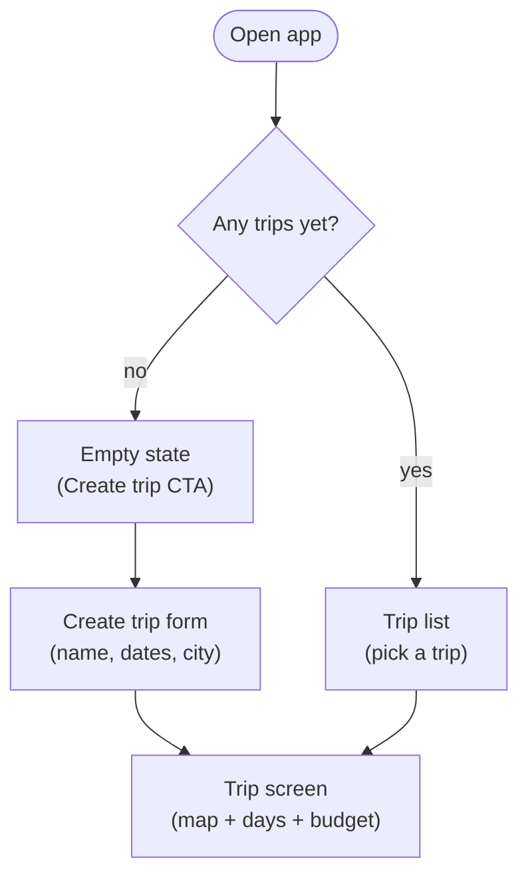
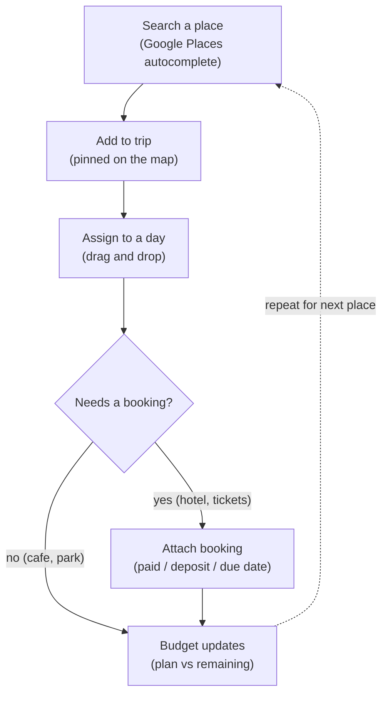
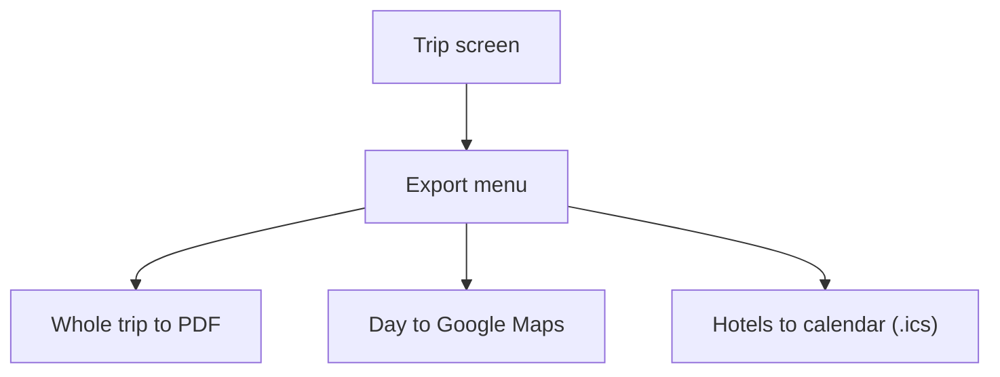
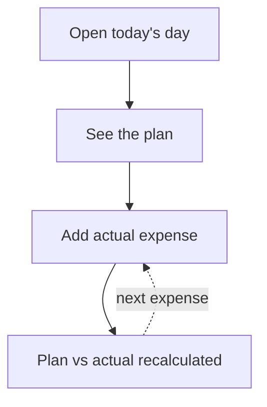

# Tripyfull — User Flows

**Status:** draft v1 · July 2026
**Related docs:** `product.md` (personas, JTBD), `competitive-analysis.md`

Mermaid diagrams render natively on GitHub/GitLab and in most IDEs.
To edit visually: FigJam → Mermaid Bridge plugin → paste the code → Generate.

---

## Flow 1 — Entry & trip creation

Covers: first launch, empty state, returning user.
JTBD: entry point for all jobs.

**Design decisions**
- Days are generated automatically from the trip date range — no manual "add day" step.
- Empty state is a designed screen, not a blank page: short value pitch + single CTA.

**Edge cases to design**
- [ ] Create form: end date before start date; very long trips (30+ days)
- [ ] Trip list: past vs upcoming trips (sort/group?)

---

## Flow 2 — Core planning loop

Covers: the repeating cycle inside a trip.
JTBD: "Plan the itinerary day by day" (Darina) + "Keep bookings and payments under control" (Darina).

**Design decisions**
- Booking is optional: a place has 0 or 1 booking (hint for the DB schema).
- Budget updates as a side effect of user actions — a live indicator on the trip
  screen, not a separate ritual. (Darina's quote: "itinerary and remaining budget
  on one screen.")
- Payment state is a first-class field: paid / deposit / due by date.
  This is differentiator #1 — no competitor tracks future payments.

**Edge cases to design**
- [ ] Places search returns nothing / no internet
- [ ] A day with no places (empty day state)
- [ ] Place without a day yet ("unassigned" bucket?)
- [ ] Payment overdue — how is it surfaced?

---

## Flow 3 — Export

Covers: getting the plan out of the app.
JTBD: "Export the whole trip" (Helga). Differentiator #2 — free and prominent.

**Design decisions**
- Export lives on the trip screen, always visible, never paywalled.

**Edge cases to design**
- [ ] Export of an incomplete trip (days without places) — allowed, with gaps

---

## Flow 4 — During the trip (v2, medium priority)

Covers: in-trip tracking. JTBD: "Track trip during the trip" (Helga).
Not in MVP, but the data model must support it from day one.

**Design decisions**
- Expense has a planned/actual flag — add to the schema now to avoid a migration
  later. Plan-vs-actual view is differentiator #3.

---

## Information architecture (derived from the flows)

| Route | Screen | Flows |
|---|---|---|
| `/trips` | Trip list / empty state | 1 |
| `/trips/new` | Create trip form | 1 |
| `/trips/:id` | Trip screen: map + days + budget widget + export | 1, 2, 3 |
| `/trips/:id/budget` | Budget detail: plan vs actual, payment schedule | 2, 4 |

Hierarchy: **Trip → Days → Places (→ 0..1 Booking → payments)**; budget is a
cross-cutting view over bookings and expenses.

---

## Next step

For every arrow above, answer: *what if it's empty / fails / offline?*
The answers become the wireframes (see step 5 of the design process).
